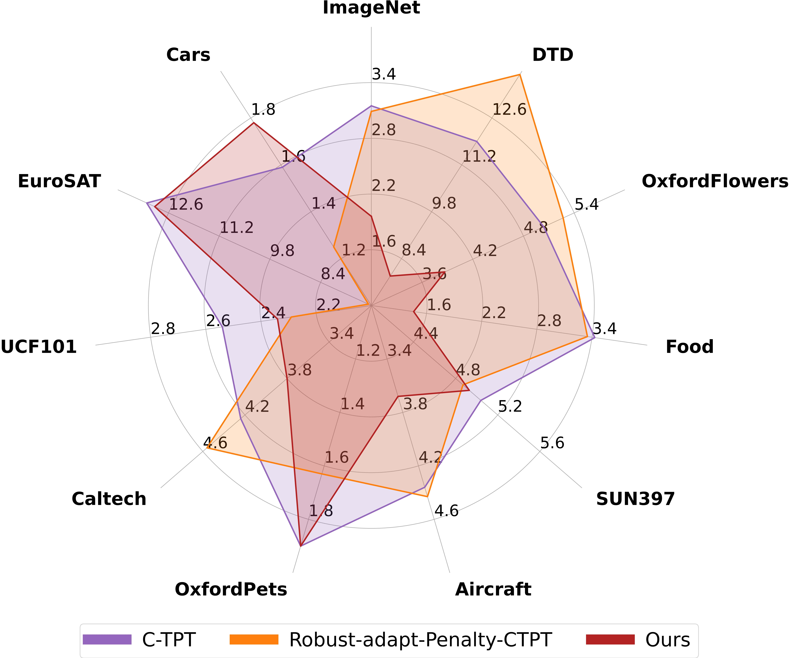
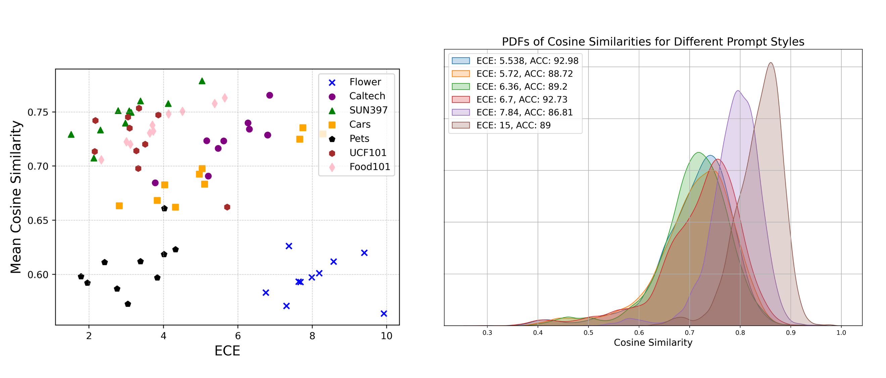

# 🚀O-TPT: Orthogonality Constraints for Calibrating Test-time Prompt Tuning in Vision-Language Models (CVPR 2025 - highlighted(Top- 13%)) 

Our contributions are summarized as follows:
  - We provide new insights underlying the suboptimal performance of an existing top-performing calibration method for test-time prompt tuning
  - We propose a novel approach (named `O-TPT`) for calibrating test-time prompt tuning for VLMs by enforcing orthogonality constraints. This is accomplished by introducing orthogonal regularization on the textual features.

  - We perform an extensive evaluation to validate our approach on various datasets and across different baselines. Results reveal that `O-TPT` provides consistent gains over the state-of-the-art methods in overall average calibration performance with several different baselines. Moreover, our `O-TPT` provides better calibration performance than the zero-shot CLIP which reveals improved calibration compared to existing SOTA 



[]()
[](https://arxiv.org/abs/2503.12096)
[](https://ashshaksharifdeen.github.io/otpt.github.io/)

## ✍️ Authors  
- **[Ashshak Sharifdeen](https://scholar.google.com/citations?user=XXXXXXX&hl=en&user=rd9zSX8AAAAJ)**  
- **[Muhammad Akhtar Munir](https://scholar.google.com.pk/citations?user=sT-epZAAAAAJ&hl=en)**  
- **[Sanoojan Baliah](https://scholar.google.com/citations?user=2WJHOBEAAAAJ&hl=en)**  
- **[Salman Khan](https://scholar.google.com/citations?user=M59O9lkAAAAJ&hl=en)**  
- **[Muhammad Haris Khan](https://scholar.google.com/citations?user=ZgERfFwAAAAJ&hl=en)**  

---

##  Relationship between cosine similarity and ECE
 

## 📌 Contents

1. [📥 Installation](#-installation)  
2. [📂 Datasets](#-datasets)  
3. [🔧 Run Experiments](#-run-experiments)  
4. [📊 Main Results](#-main-results)  
5. [🙏 Acknowledgement](#-acknowledgement)  
6. [📖 Citation](#-citation)  
7. [📧 Contact](#-contact)

## 📥 Installation
```bash
#Steps to set up the environment
 1. git clone https://github.com/ashshaksharifdeen/O-TPT.git
 2. cd O-TPT
 3. conda env create -f environment.yml
 4. conda activate otpt
```

## 📂 Datasets
We have conducted main experiments on fine-grained and natural distribution shift datasets:

- **Fine-grained datasets**:  
  1. ImageNet  
  2. Flower102  
  3. OxfordPets  
  4. SUN397  
  5. DTD  
  6. Food101  
  7. StanfordCars  
  8. Aircraft  
  9. UCF101  
  10. EuroSAT  
  11. Caltech101  

- **Natural distribution shift datasets**:  
  1. ImageNet-V2  
  2. ImageNet-A  
  3. ImageNet-R  
  4. ImageNet-Sketch

Follow this repository for datasets preparation: [TPT](https://github.com/azshue/TPT) 

## 🔧 Run Experiments
In each .sh file, you can edit the root dataset directory location as well as configure the baseline, whether it's ‘RN50’ or ‘ViT-B/16’. Also, you can switch between different experiment modes by changing run_type, whether it is opt, tpt baselines, or calibration with temperature scaling.  

🏁 Baseline Experiment

```bash
#bash scripts/test_baseline.sh /I/DTD/Flower102/Food101/Cars/SUN397/Aircraft/Pets/Caltech101/UCF101/eurosat for fine-grained classification
  bash scripts/test_baseline.sh {dataset}
  
```

🎯 TPT Experiment
```bash

#Fine-grained classification
bash scripts/test_tpt_fg.sh {dataset}

#Natural distribution shift
bash scripts/test_tpt_ds.sh {dataset}

```

🔥 O-TPT Experiment

```bash
#Fine-grained classification
bash scripts/test_tpt_otpt_fg.sh {dataset}

#natural distribution shift
bash scripts/test_tpt_otpt_ds.sh {dataset}

```

## 📊 Main Results
#### Comparison of calibration performance with CLIP-ViTB/16 backbone.

| Method                          | Metric  | INet  | DfID  | FLW   | Food  | SUN   | Air   | Pets  | Calt  | UCF   | SAT   | Car   | Avg   |
|---------------------------------|---------|-------|-------|-------|-------|-------|-------|-------|-------|-------|-------|-------|-------|
| Zero Shot                       | Acc.    | 66.7  | 44.3  | 67.3  | 83.6  | 62.5  | 23.9  | 88.0  | 92.9  | 65.0  | 41.3  | 65.3  | 63.7  |
|                                 | ECE     | 2.12  | 8.50  | 3.00  | 2.39  | 2.53  | 5.11  | 4.37   | 5.50  | 3.59  | 13.89  | 4.25 | 4.43  |
| TPT                             | Acc.    | 69.0  | 46.7  | 69.0  | 84.7  | 64.5  | 23.4  | 87.1  | 93.8  | 67.3  | 42.4  | 66.3  | 65.0  |
|                                 | ECE     | 10.6  | 21.2  | 13.5  | 3.98  | 11.3  | 16.8  | 5.77  | 4.51  | 2.54  | 13.2  | 5.16  | 11.6  |
| C-TPT                           | Acc.    | 68.5  | 46.0  | 69.8  | 83.7  | 64.8  | 24.85 | 88.2  | 93.63  | 65.7  | 43.2  | 65.8 | 64.57 |
|                                 | ECE     | 3.15  | 11.9  | 5.04  | 3.43   | 5.04  | 4.36  | 1.9  | 4.24  | 2.54  | 13.2   | 1.59  | 5.13  |
| Robust-adapt-SaLs-CTPT          | Acc.    | 68.04 | 45.51 | 69.43 | 83.18 | 64.38 | 23.94 | 88.12 | 93.63  | 65.32 | 43.05 | 65.48 | 64.55 |
|                                 | ECE     | 2.63  | 14.56 | 2.74  | 1.26  | 3.56  | 6.21  | 3.16  | 3.78  | 6.96  | 14.92  | 2.82  | 5.69  |
| Robust-adapt-Penalty-CTPT       | Acc.    | 68.04 | 45.69 | 69.55 | 83.28 | 64.36 | 23.91 | 87.95 | 93.47  | 65.32 | 44.06 | 65.53 | 64.65 |
|                                 | ECE     | 2.63  | 13.9 | 5.27  | 3.35  | 4.87  | 4.43  | 1.63  | 4.56  | 2.29  | 7.08  | 1.25  | 4.66  |
| Robust-adapt-ZS-CTPT            | Acc.    | 68.01 | 45.63 | 69.55 | 83.25 | 64.41 | 23.88 | 88.03 | 93.31 | 65.24 | 42.64 | 65.45 | 64.51 |
|                                 | ECE     | 3.01  | 12.35 | 4.94  | 3.8   | 5.16  | 4.31  | 2.06  | 4.34  | 2.17  | 12.23  | 1.7   | 5.09  |
| O-TPT (Ours)                    | Acc.    | 67.33 | 45.68 | 70.07 | 84.13 | 64.23 | 23.64 | 87.95 | 93.95 | 64.16 | 42.84 | 64.53 | **64.41** |
|                                 | ECE     | 1.96  | 7.88  | 3.87  | 1.46  | 4.93  | 3.68  | 1.9   | 3.8  | 2.34 | 12.98  | 1.78 |**4.21** |

#### 🌍 Comparison of calibration performance with CLIP-ViTB/16 backbone on Natural distribution shift datasets:

| Method              | Metric | I-A  | I-V2  | I-R  | I-S  | Avg  |
|---------------------|--------|------|------|------|------|------|
| CLIP-ViT-B/16      | Acc.   | 47.8 | 60.8 | 74.0 | 46.1 | 57.2 |
|                     | ECE    | 8.61 | 3.01 | 3.58 | 4.95 | 5.04 |
| TPT                | Acc.   | 52.6 | 63.0 | 76.7 | 47.5 | 59.9 |
|                     | ECE    | 16.4 | 11.1 | 4.36 | 16.1 | 12.0 |
| C-TPT              | Acc.   | 51.6 | 62.7 | 76.0 | 47.9 | 59.6 |
|                     | ECE    | 8.16 | 6.23 | 1.54 | 7.35 | 5.82 |
| O-TPT (Ours)       | Acc.   | 49.87 | 61.65 | 72.55 | 47.12 | 57.80 |
|                     | ECE    | 7.22 | 3.97 | 1.46 | 6.87 | **4.88** |

## 🙏 Acknowledgement
We are thankful to the authors of [TPT](https://github.com/azshue/TPT), [C-TPT](https://github.com/hee-suk-yoon/C-TPT?tab=readme-ov-file), and [CoOp/CoCoOp](https://github.com/KaiyangZhou/CoOp) for their open-source contributions.

##  📖 Citation
If you find our work useful for your research, please consider citing it:
```bibtex
@misc{sharifdeen2025otptorthogonalityconstraintscalibrating,
      title={O-TPT: Orthogonality Constraints for Calibrating Test-time Prompt Tuning in Vision-Language Models}, 
      author={Ashshak Sharifdeen and Muhammad Akhtar Munir and Sanoojan Baliah and Salman Khan and Muhammad Haris Khan},
      year={2025},
      eprint={2503.12096},
      archivePrefix={arXiv},
      primaryClass={cs.CV},
      url={https://arxiv.org/abs/2503.12096}, 
}
```
## 📧 Contact
If you need any further clarification, please feel free to contact me at [ashshaks@gmail.com](mailto:ashshaks@gmail.com).

